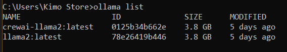

# Running the Streamlit Chatbot

Follow these steps to run the Streamlit chatbot on your local machine:

## Prerequisites
1. Ensure you have Python installed.
2. Install required dependencies by running:
   ```bash
   pip install -r requirements.txt
   ```

## Steps to Run
1. Navigate to the project directory in your terminal.
   ```bash
   cd your_project_directory
   ```

2. Run the Streamlit application:
   ```bash
   streamlit run app.py
   ```

   Replace `app.py` with the filename of your Streamlit script if it is named differently.

3. Open the URL provided by Streamlit in your browser (usually `http://localhost:8501`).

4. Interact with the chatbot through the user interface.

## Starting Fresh
If you want to start a new conversation or reset the history, use the "Start New Conversation" button provided in the app.


## Ollama Setup Commands

### Installation
Download the latest version of Ollama from the [official website](https://ollama.com)

### Ollama CLI Cheat Sheet

Quick reference for basic `ollama` commands.

## Commands Overview

- **serve**: Start the Ollama service.
- **create**: Create a new model using a Modelfile.
- **show**: Display details for a specific model.
- **run**: Execute a model.
- **stop**: Stop a running model.
- **pull**: Download a model from a registry.
- **push**: Upload a model to a registry.
- **list**: List all available models.
- **ps**: Show currently running models.
- **cp**: Copy a model to a new location.
- **rm**: Delete a model.
- **help**: Display help for commands.

## Flags

- **-h, --help**: Show help information.
- **-v, --version**: Show version details. 

Use `ollama [command]` to execute any command above.

## Ollama Command Cheat Sheet

A quick reference for commands inside Ollama models:

- **/set**: Set session variables.
- **/show**: Display information about the current model.
- **/load <model>**: Load a specific session or model.
- **/save <model>**: Save your current session.
- **/clear**: Clear the session context.
- **/bye**: Exit the session.
- **/?, /help**: Show help for commands.
- **/? shortcuts**: Display help for keyboard shortcuts.

**Tip:** Use `"""` to start a multi-line message.

## Ollama API Cheat Sheet [Link](https://github.com/ollama/ollama/blob/main/docs/api.md)
### Generate
```bash
POST /api/generate
curl http://localhost:11434/api/generate -d '{
  "model": "llama3.2:1b",
  "prompt": "Why is the sky blue?",
  "stream": false
}'
```

### Chat Completion
```bash
POST /api/chat
curl http://localhost:11434/api/chat -d '{
  "model": "llama3.2:1b",
  "messages": [
    {
      "role": "user",
      "content": "why is the sky blue?"
    }
  ],
  "stream": false
}'
```

## pull your model     
                                
```bash
ollama pull llama2
```
## Check your list of models
                                
```bash
ollama pull llama2
```
                
                                
## Create a New Model with Custom Settings [Link](https://github.com/ollama/ollama/blob/main/docs/modelfile.md)
    
```bash
ollama create new_model_name -f .\modelfile.txt
```
With these settings, the Streamlit chatbot will communicate with the Ollama server to process user inputs.
